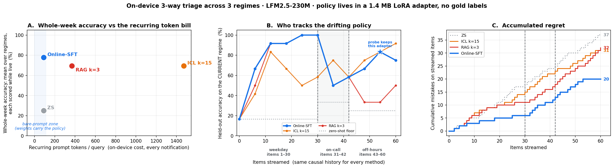

# Online SFT

[](https://colab.research.google.com/github/lin826/Online-SFT-Demo/blob/main/online_sft_colab.ipynb)

A phone-class 230M model ([LFM2.5-230M](https://huggingface.co/LiquidAI/LFM2.5-230M)) learns your **drifting** notification-triage policy **online** — one `batch_size=1` LoRA update per item with **cross-entropy on the observed action** (open / wait / never). The learned policy is a **~1.4 MB adapter** served with a bare ~90-token prompt, beating causal ICL and RAG on whole-week accuracy, accumulated regret, and per-query cost.



Minimal companion demo for the blog post *"Your phone should learn your attention, not just borrow it"* — online supervised fine-tuning (SFT) on a drifting stream. Optional soft-distillation knobs remain in the trainer for experiments; the shipped defaults use hard CE only.


## Reproduce

```bash
pip install -r requirements.txt
```

```bash
python run.py
```

That runs the causal baselines (including ICL/RAG *k* selection), the online SFT loop, and draws every figure — `outputs/results.json` + `figures/*.png`, seeded end to end (same command, same numbers on the same device). About 15 minutes on an M-series Mac (MPS) or any CUDA GPU. Latency and peak-memory for each arm land in `outputs/perf.json` and `figures/online_sft_perf.png` (re-measure from a saved adapter with `python run_perf.py`).

Prefer a Colab Jupyter Notebook finished in ~3 minutes? Open [online_sft_colab.ipynb](https://colab.research.google.com/github/lin826/Online-SFT-Demo/blob/main/online_sft_colab.ipynb) on a free Colab T4 — standalone, it fetches the seeded dataset straight from this repo and draws the figure in-notebook.

## What's here

| File                     | Role                                                                                         |
| ------------------------ | -------------------------------------------------------------------------------------------- |
| `triage_common.py`       | the drifting inbox stream, the 3-way policy, model helpers                                   |
| `triage_perf.py`         | serve latency / peak-memory helpers + the on-device cost figure                               |
| `run_baselines.py`       | causal ZS / ICL / RAG arms + ICL *k* selection → `outputs/baselines.json`                    |
| `run_sft.py`             | the online SFT loop (serve → observe action → LoRA CE update → guardrail) → results + figures |
| `run_perf.py`            | re-measure latency/memory from a saved adapter and redraw the perf figure                    |
| `draw_loop_diagram.py`   | the TEACH / CHECK / LEARN loop diagram                                                       |
| `online_sft_colab.ipynb` | standalone Colab demo (run + draw in-notebook)                                               |
| `data/inbox_triage.json` | the seeded dataset (re-exported and verified on every baselines run)                         |
