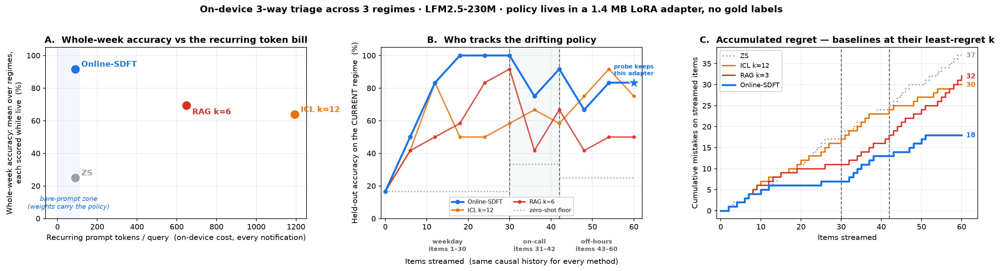

# online-sdft-triage

A phone-class 230M model ([LFM2.5-230M](https://huggingface.co/LiquidAI/LFM2.5-230M))
learns your **drifting** notification-triage policy **online** — one
`batch_size=1` LoRA update per item, supervised only by implicit feedback
(which notifications you opened), **no gold labels** — and beats causal ICL and
RAG baselines on whole-week accuracy, accumulated regret, and per-query cost.
The learned policy is a **~1.4 MB adapter** served with a bare ~90-token prompt.



Companion code for the blog post *"Your phone should learn your attention, not
just borrow it"*, using **self-distillation fine-tuning (SDFT)**
([Shenfeld et al., 2026](https://arxiv.org/abs/2601.19897)) run online.

## Reproduce

```bash
pip install -r requirements.txt
```

```bash
python run.py
```

That runs the causal baselines (with their k sweeps), the online SDFT loop, and
draws every figure — `outputs/results.json` + `figures/*.png`, seeded end to
end (same command, same numbers on the same device). ~15 min on an M-series
Mac (MPS) or any CUDA GPU.

Prefer a notebook? Open
[`online_sdft_colab.ipynb`](https://colab.research.google.com/github/lin826/online-sdft-triage/blob/main/online_sdft_colab.ipynb)
on a free Colab T4 — standalone, it fetches the seeded dataset straight from
this repo.

Optional:

```bash
python sweep_sdft.py     # the hyper-parameter sweep that picked the shipped setup
```

## What's here

| File | Role |
| --- | --- |
| `triage_common.py` | the drifting inbox stream, the 3-way policy, model helpers |
| `run_baselines.py` | causal ZS / ICL / RAG arms + both k sweeps → `outputs/baselines.json` |
| `run_sdft.py` | the online SDFT loop (prequential guess → feedback → update → guardrail) → results + figures |
| `sweep_sdft.py` | the sweep behind the shipped hyper-parameters (regret-primary) |
| `draw_loop_diagram.py` | the TEACH / CHECK / LEARN loop diagram |
| `data/inbox_triage.json` | the seeded dataset (re-exported and verified on every baselines run) |

Extracted from the [Local-SDFT](https://github.com/lin826/Local-SDFT) project. MIT license.
